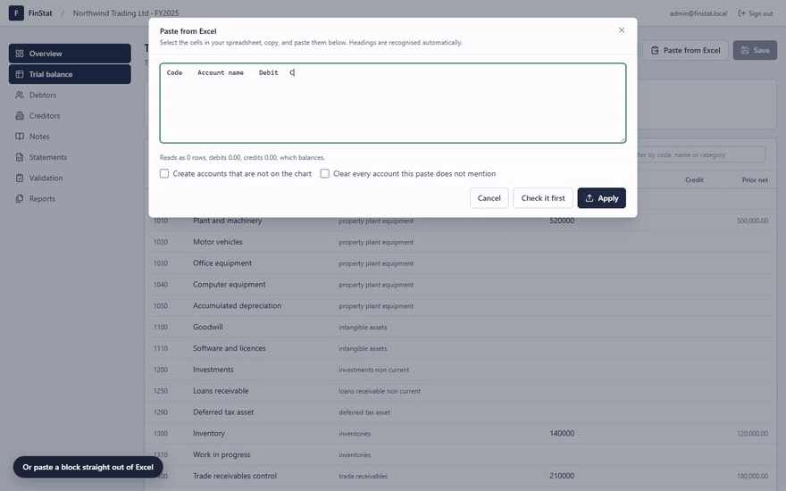
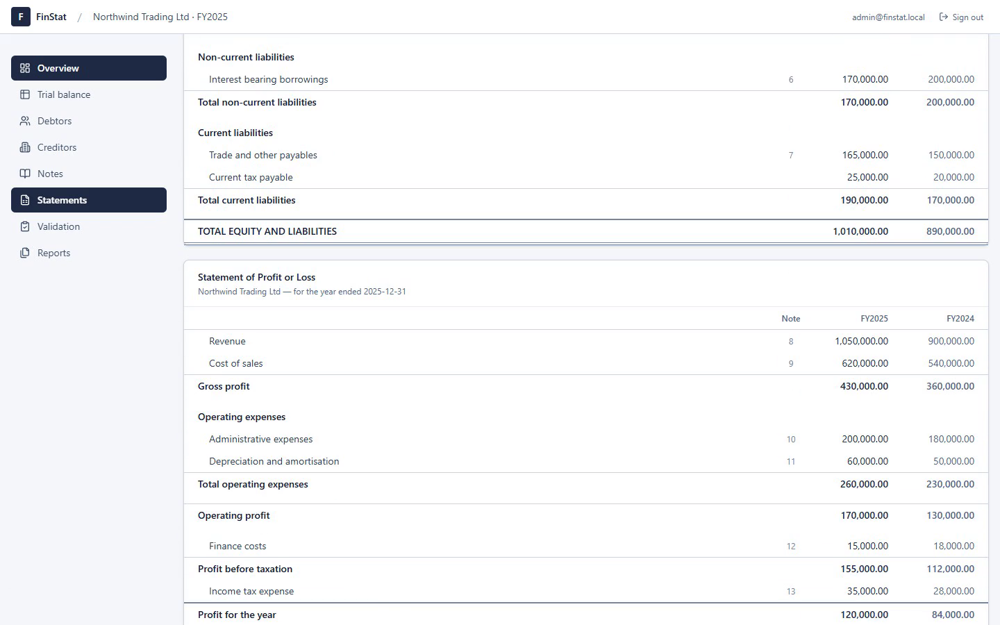
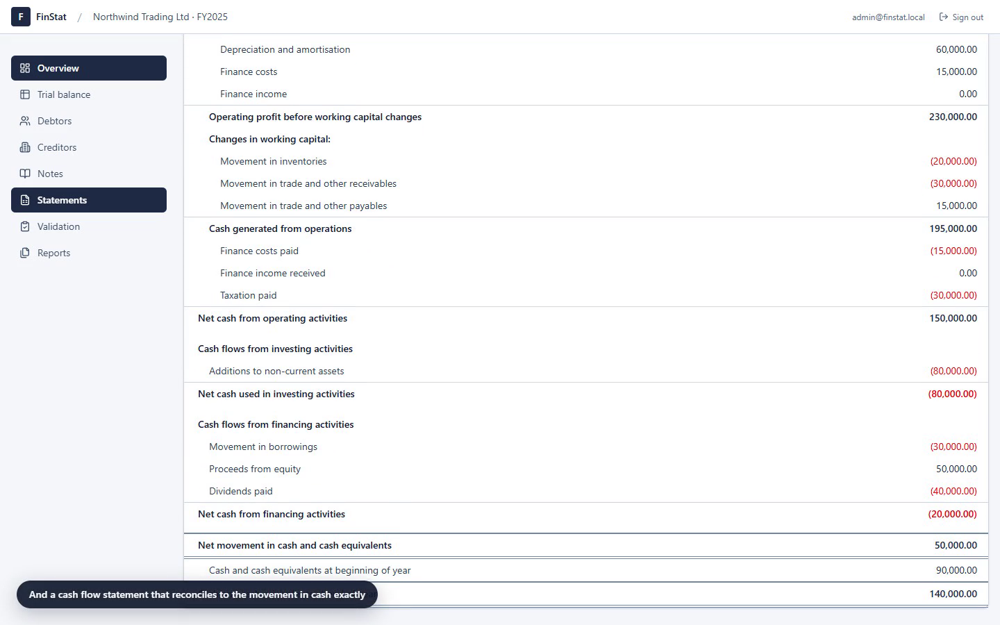
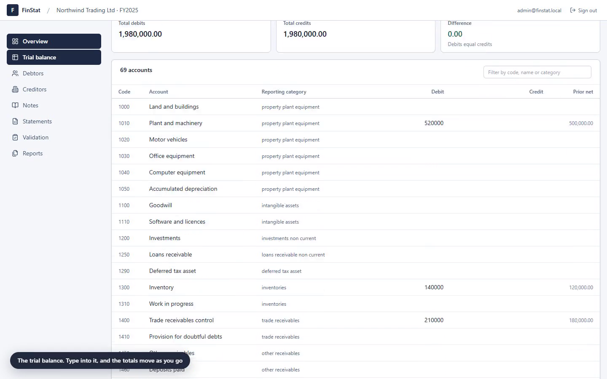
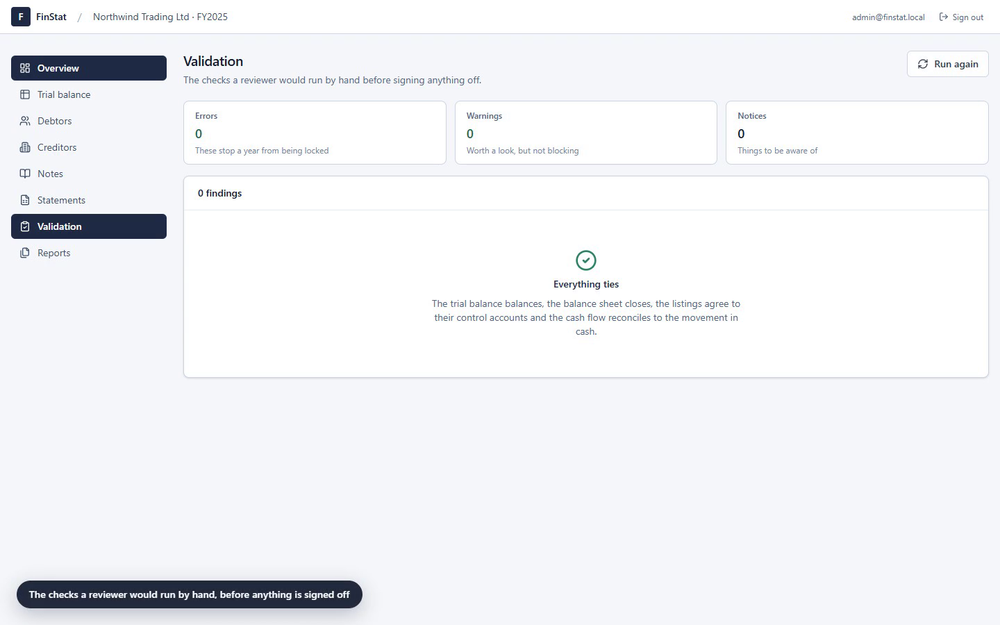

# FinStat

Web based financial statement preparation. You capture a trial balance, and the
balance sheet, profit and loss, cash flow statement and notes come out the other
side, with every figure traced back to one account on one chart.

Nothing is stored twice. The statements are computed from the trial balance
every time they are asked for, so a figure can never disagree with itself
between the screen, the PDF and the workbook.

**Next.js · NestJS · PostgreSQL · Prisma · Redis · BullMQ · ExcelJS · pdfmake · TypeScript throughout**

**[Project page →](https://abdelrahmanyahia2002.github.io/finstat/)** — the walkthrough,
the screenshots, and how the numbers actually tie.

---

## Demo

Paste a block of cells out of Excel. It reads the headings, the thousands
separators and the accounting brackets, tells you exactly what it would change,
and writes nothing until you say so.



**[Watch the full two minute walkthrough →](docs/demo.mp4)** — sign in, the
chart of accounts, trial balance entry, the Excel paste, the debtors listing
reconciling to its control account, all three statements, the validation run,
the notes, report generation, and carrying a year forward into the next one.

<table>
  <tr>
    <td width="50%"></td>
    <td width="50%"></td>
  </tr>
  <tr>
    <td></td>
    <td></td>
  </tr>
</table>

The walkthrough is scripted, not hand recorded: `node scripts/record-demo.mjs`
drives the real app in Chrome, captures it through the DevTools screencast, and
encodes it with ffmpeg. Re-running it produces the same video against the
current build.

---

## Getting it running

You need Node 20 or newer and Docker.

```bash
npm run setup
```

That installs everything, builds the shared package, starts PostgreSQL and
Redis, runs the migration, and seeds a demo company with two complete financial
years. Then, in two terminals:

```bash
npm run dev:api
```

```bash
npm run dev:web
```

The app is at http://localhost:3000, the API at http://localhost:4000/api, and
the API reference at http://localhost:4000/api/docs.

Sign in with `admin@finstat.local` / `Admin123!` (owner) or
`preparer@finstat.local` / `Preparer123!` (preparer).

Copy `.env.example` to `.env` before the first run if `npm run setup` has not
done it for you. Change both JWT secrets before this goes anywhere real.

### Doing it by hand

```bash
npm install
npm run build:shared        # both apps import the compiled package
npm run db:up               # postgres on 5433, redis on 6380
npm run db:migrate
npm run db:seed
```

Ports 5433 and 6380 are deliberate, so a Postgres or Redis you already run on
the standard ports is left alone.

---

## What is in the box

| Feature | Where it lives |
| --- | --- |
| Sign in, refresh, roles | `apps/api/src/auth`, `apps/web/src/lib/session.tsx` |
| Companies, members, settings | `apps/api/src/companies`, `apps/api/src/settings` |
| Financial years and carry forward | `apps/api/src/financial-years` |
| Chart of accounts | `apps/api/src/accounts` |
| Trial balance entry and paste | `apps/api/src/trial-balance` |
| Debtors and creditors | `apps/api/src/parties` |
| Notes and disclosures | `apps/api/src/notes` |
| Balance sheet, P&L, cash flow | `packages/shared/src/statements.ts` |
| Validation | `packages/shared/src/validation.ts` |
| Excel import and export | `apps/api/src/excel` |
| PDF reports | `apps/api/src/reports/pdf.service.ts` |
| Background jobs | `apps/api/src/jobs` |
| Audit trail | `apps/api/src/audit` |

---

## How the numbers work

### One trial balance in, three statements out

The model is a **pre-closing trial balance**: it carries the profit and loss
accounts alongside retained earnings brought forward. That is what makes the
balance sheet close by construction. If debits equal credits then, writing every
balance debit-positive:

```
assets + expenses − liabilities − equity − income = 0
assets = liabilities + equity + (income − expenses)
assets = liabilities + equity + profit
```

so folding the year's profit into retained earnings balances the sheet exactly.
Any imbalance a user sees is a real imbalance in their data, never an artefact
of the engine. There is a property test covering this: 200 randomised trial
balances, each of which must produce a balance sheet that closes to the cent.

### Mapping is the whole trick

Every account is mapped to exactly one **statement section** from the taxonomy
in `packages/shared/src/taxonomy.ts`. That one mapping drives the face of the
balance sheet, the face of the profit and loss, the classification in the cash
flow statement, and which note gets generated. An account cannot be mapped to a
section of the wrong type: a revenue account will not go under current assets.

### The cash flow statement actually reconciles

It is the indirect method, built from the movement between two balance sheets
plus the current year's profit and loss. Every balance sheet section belongs to
exactly one bucket (working capital, investing, financing, taxation, non-cash
addback, or cash), which is why the statement reconciles to the movement in cash
**to the cent** rather than approximately. A hundred randomised second years are
tested for this.

It rests on one assumption: this year's opening retained earnings equal last
year's closing retained earnings. Carrying a year forward guarantees that, and
`OPENING_RETAINED_EARNINGS` in the validation run is the check that says so out
loud when somebody has edited the opening figure by hand.

### Carrying a year forward

Balance sheet accounts open where they closed. Profit and loss accounts start at
nil. The year's profit and any dividends declared roll into retained earnings.
The debtors and creditors listings travel with their control accounts, because
otherwise the new year opens with a control account and an empty listing, which
reads as a reconciliation error nobody caused.

It refuses to run if the source year does not balance, or if any account with a
balance has no reporting category, because either would quietly corrupt the new
year.

### Validation

The checks a reviewer would run by hand. They never change a number; they report
what does not tie, with the amount.

| Check | Severity |
| --- | --- |
| Trial balance balances | error |
| Balance sheet closes | error |
| Every account is mapped | error |
| No duplicate account codes | error |
| Debtors agree to the control account | error |
| Creditors agree to the control account | error |
| Opening retained earnings follow last year | error |
| Cash flow reconciles to the movement in cash | error |
| Notes tie to the face of the statements | error |
| A statement line on the unexpected side | warning |
| Ageing buckets do not add to the balance | warning |
| Net cash is negative | warning |
| No comparative year linked | notice |

Errors block a year from being locked or closed. Warnings do not.

The wrong-side check looks at **section totals**, not individual accounts.
Contra accounts are ordinary bookkeeping: accumulated depreciation is a credit
inside property plant and equipment, a doubtful debt provision is a credit
inside receivables, and dividends declared is a debit inside equity. Flagging
those one by one would bury the case that matters.

---

## Working with Excel

### Pasting

Select cells in Excel, copy, paste into the grid. The parser handles what Excel
actually puts on the clipboard: tab separated cells, CRLF row breaks, quoted
cells containing tabs, and amounts written every way a spreadsheet might have
formatted them.

```
1,234.56    1.234,56    (1,234.56)    R 1 234.56    1234.56-    $-99.99
```

Column headings are recognised automatically. Without headings the shape is
worked out instead, and an account code is not mistaken for an amount. A totals
row at the bottom is skipped rather than imported as an account.

A paste is previewed before it is applied, and the whole block goes in or none
of it does. A half applied trial balance is worse than a rejected one, because
the difference it leaves looks like a real accounting error.

### Importing and exporting

An uploaded workbook is flattened to the same tab separated form a paste
produces, so importing a file and pasting a block go through **one parser** and
can never disagree about what a row means.

Exports: the full pack (statements, notes, listings, trial balance, validation),
the trial balance with last year alongside, and an empty import template with
every valid reporting category on a reference sheet.

Reports build as background jobs on BullMQ, so a long export does not hold an
HTTP connection open behind a proxy.

---

## Access

Roles are ranked, and each covers everything below it.

| Role | Can |
| --- | --- |
| `OWNER` | Everything, including deleting the company |
| `ADMIN` | Everything except deleting the company |
| `PREPARER` | Enter and change figures, notes and listings |
| `REVIEWER` | Read everything, and lock or reopen a year |
| `VIEWER` | Read only |

Two guards do the work. `CompanyAccessGuard` proves the caller is a member of
the company in the URL before any controller sees the request.
`FinancialYearScopeGuard` confirms the year in the URL belongs to that company,
so pairing your own company id with somebody else's year id gets a 404 rather
than their figures. `EditableYearGuard` sits on top of writes and refuses a
locked or closed year.

A caller who is not a member gets **not found**, not forbidden, so the response
cannot be used to discover which companies exist.

---

## Testing

```bash
npm test                 # engine unit and property tests
```

35 tests over the money arithmetic, the statement engine, the cash flow
reconciliation, the validation rules and the clipboard parser, including 300
randomised property checks.

```bash
cd apps/api && node scripts/smoke.mjs
```

72 checks driving the running API exactly as the web app does: sign in, read the
seeded company, confirm the statements balance, paste a trial balance, run the
validation, carry a year forward, and pull a real PDF and workbook out the other
side. It asserts figures an accountant would check, not just status codes, and
it leaves the database as it found it so it can be run repeatedly.

Both servers need to be running for the smoke test.

---

## Layout

```
finstat/
  packages/shared/      the taxonomy, the statement engine, validation, the
                        clipboard parser. Pure functions, no framework, so the
                        same code runs on the API and in the browser.
  apps/api/             NestJS, Prisma, PostgreSQL, Redis, BullMQ, ExcelJS,
                        pdfmake
  apps/web/             Next.js App Router, React, TanStack Query, Tailwind
```

The shared package is why a figure previewed in the browser and a figure printed
in a PDF cannot drift apart: they are the same function.

### Money

Amounts cross boundaries as plain numbers, but all arithmetic converts to
integer minor units first, so a balance sheet foots to the cent. `1.005 * 100`
is `100.49999999999999` in binary floating point, so rounding it directly loses
the cent; `round2` passes through `toPrecision(15)` to collapse that
representation error before the rounding decision.

Prisma stores `Decimal(18,2)` and the conversion happens once, in
`apps/api/src/common/decimal.ts`, rather than in every service.

---

## Notes for whoever picks this up next

- **Statements are never stored.** If you find yourself caching a computed
  balance, that is the moment two figures start being able to disagree.
- **Posted adjustments fold into the balances at read time** rather than being
  written over the imported trial balance, so the original figures stay visible
  next to what was changed.
- **An account with balances against it is deactivated, never deleted**, because
  deleting one would silently rewrite the history of every year it appears in.
- **Regenerating notes leaves edited ones alone.** Editing a generated note
  makes it yours; the generator will renumber it into statement order but will
  not touch its words again.
- **`tsBuildInfoFile` is inside `dist` on purpose.** `nest build` clears `dist`;
  if the incremental cache sits outside it, a cleared output plus a warm cache
  emits almost nothing and the result looks like a successful build with half
  the files missing.

### Not built

- Multi-currency translation. Each company reports in one currency.
- A statement of changes in equity. The data is there; the statement is not.
- Comparative figures on the cash flow statement, which would need a third year.
- Email. There is no invite flow: a person signs up, then an admin adds them to
  a company by email address.

---

## Licence

MIT. See [LICENSE](LICENSE).
